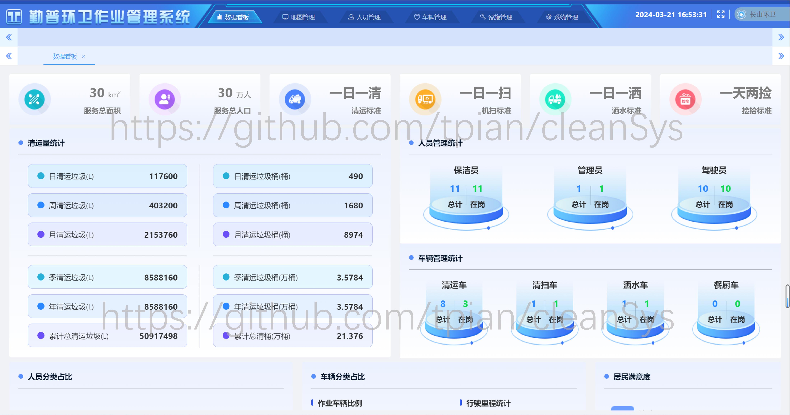
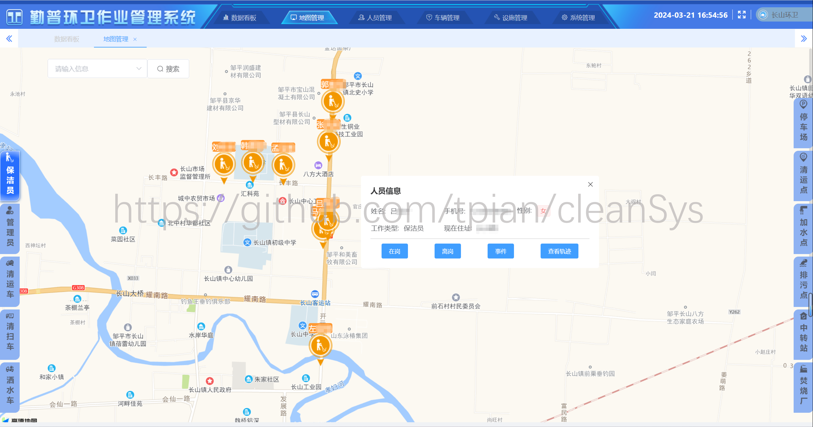
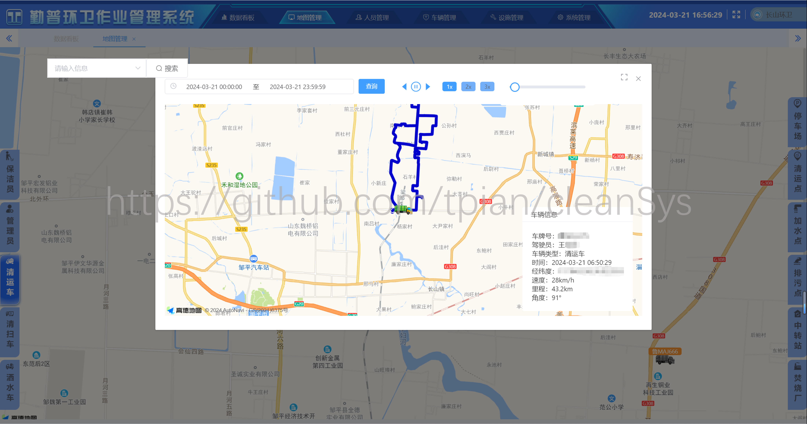
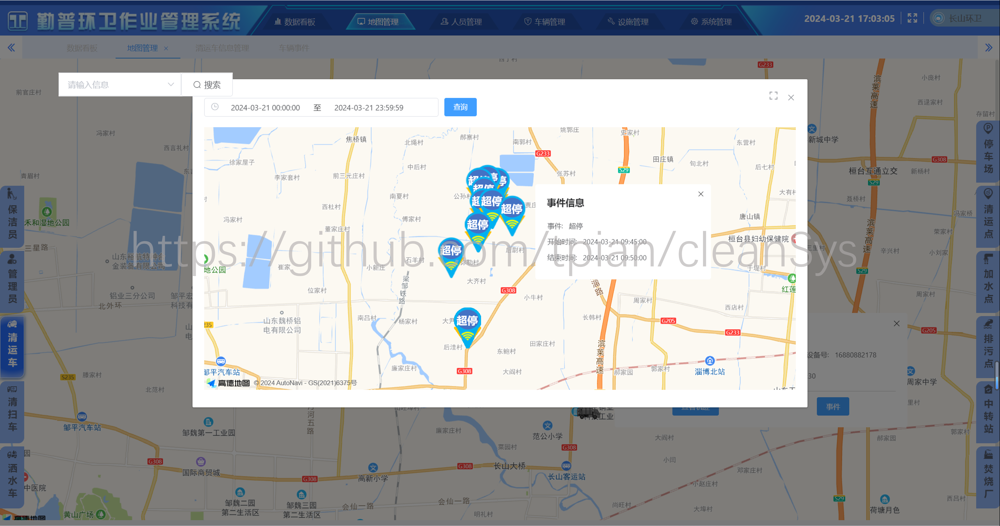
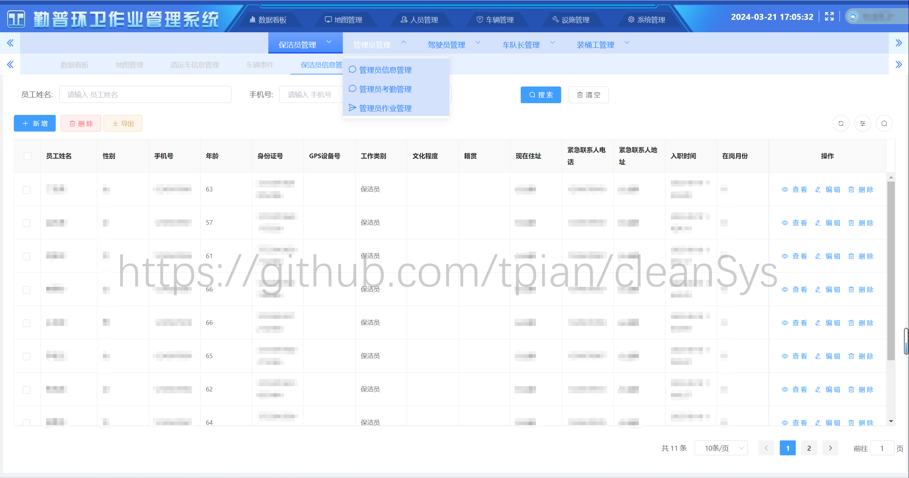
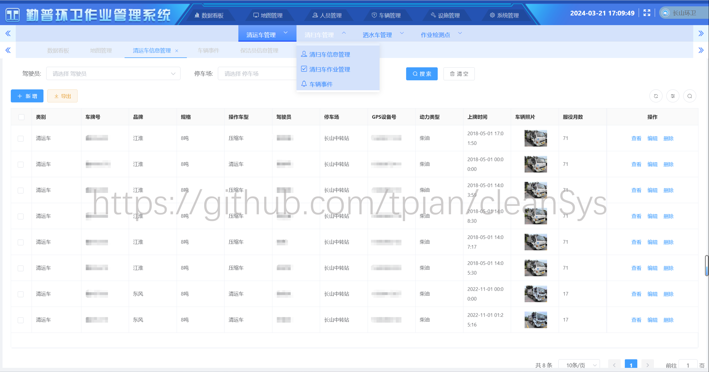
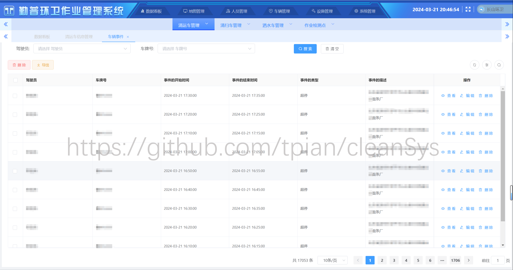
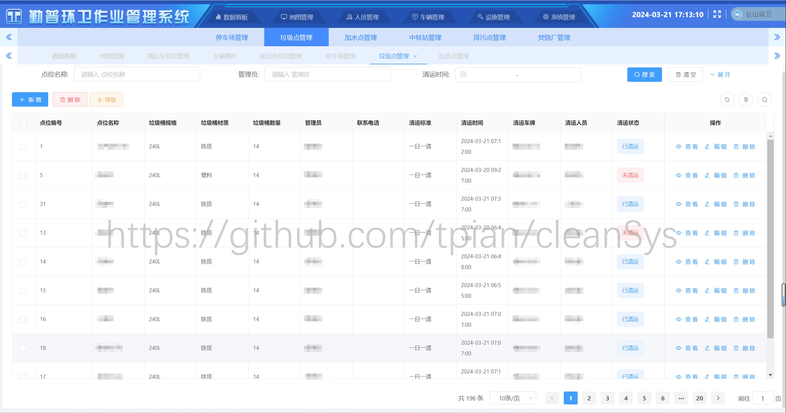
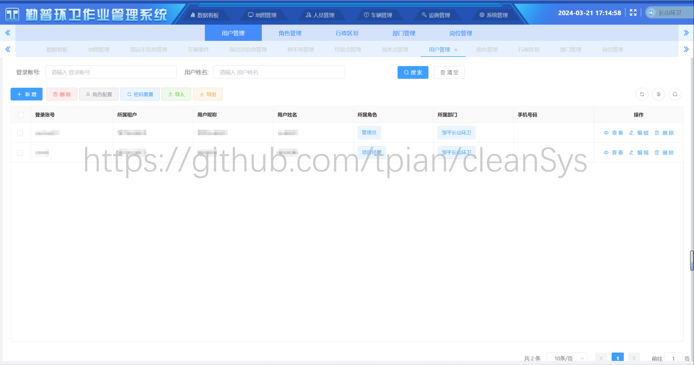
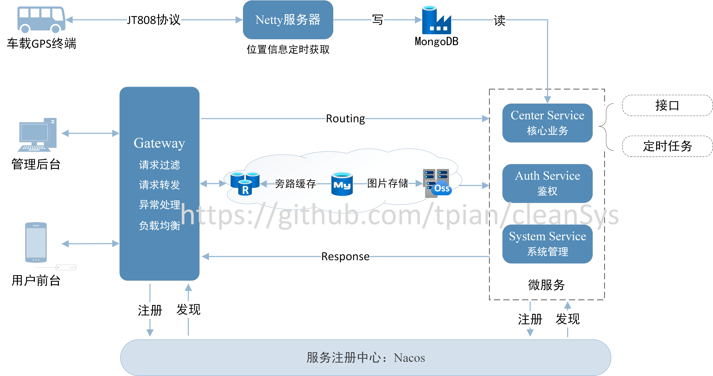

# cleanSys

对环卫作业管理系统的简要介绍，项目线上地址：https://www.huanweiguanli.com 。
由于管理系统数据敏感，不提供访问账号密码，下面对项目框架、效果等方面内容进行介绍。

## 效果展示

### 小程序端

### 后台管理端

登录页

数据看板

员工位置可视化

车辆轨迹可视化

车辆事件可视化

清运点状态可视化

员工管理

车辆管理

点位管理

系统管理

## 项目框架

**详细内容正在完善编辑中**
